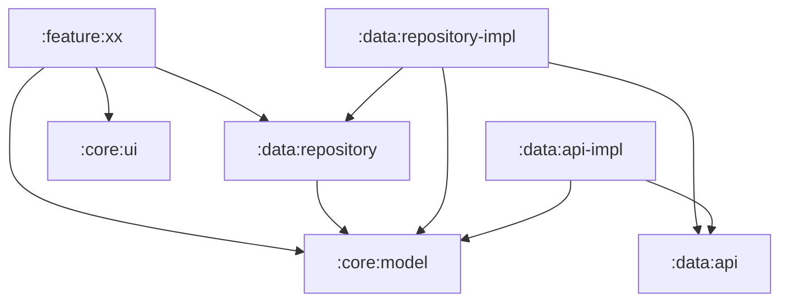

# GitHubClient

## 動画

<image width="400" src="./art/screen_recording.gif" />

## 環境

- JDK 17
- Android Studio Iguana 以上

## アーキテクチャ

MVVM + Redux

<image width="400" src="./art/architecture.png" />

## モジュール構成

